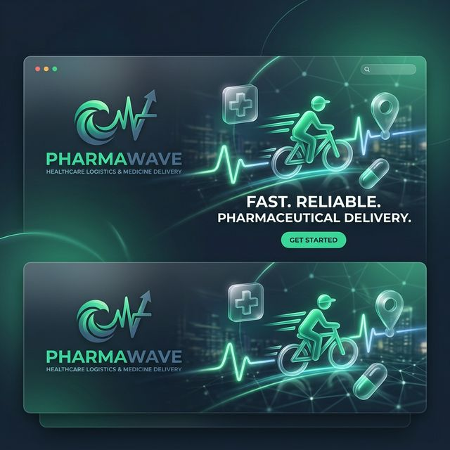
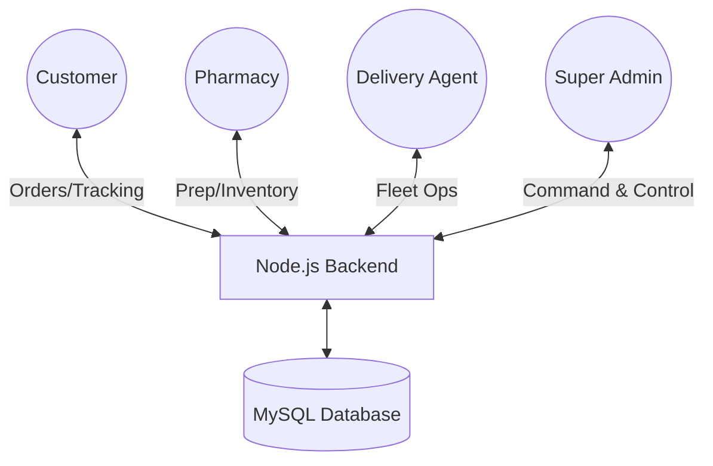

<div align="center">
  

  # 📈 PharmaWave
  ### *The Next-Generation Healthcare Logistics & Medicine Delivery Platform*

  [](https://nodejs.org/)
  [](https://www.mysql.com/)
  [](https://socket.io/)
  [](https://opensource.org/licenses/MIT)

  **PharmaWave** is a robust, production-grade project designed to solve complex pharmaceutical delivery challenges. It features a multi-role architecture that seamlessly connects customers, pharmacies, and delivery agents through a centralized, real-time administrative command center.
</div>

---

## 🏗️ System Architecture

PharmaWave is built on a distributed logic system using **WebSockets** for instant data synchronization across four distinct portals:



---

## 🔥 Performance Features

### 🏢 Admin Control Suite
- **Fleet Management**: Real-time monitoring of agent health, vehicle type, and live availability.
- **Intelligent Routing**: Assign orders to agents manually or via the high-concurrency **Agent Pool**.
- **Data Integrity**: Built-in **Cascaded Deletion** logic to ensure flawless database cleanup when removing accounts.
- **Business Intelligence**: Instant billing engine with printable PDF-style invoices and prescription validation.

### 🚲 Specialized Fleet Portal
- **Biometric Guard**: Secure login utilizing hardware-level biometric validation.
- **Dynamic Delivery**: OpenStreetMap integration for turn-by-turn navigation and proximity-based deliveries.
- **Status Engine**: Instant WebSocket triggers that notify customers the moment their delivery starts.

### 🛡️ Security First
- **Hybrid Auth**: A secure combination of **Google OAuth 2.0 (Firebase)** and custom **JWT** authentication.
- **Input Guard**: Advanced Regex validation for all manual login entry points (Email/Mobile).
- **Data Safety**: BCrypt-encrypted password storage and secure session management.

---

## 🛠️ Technical Specifications

| Layer | Technology |
| :--- | :--- |
| **Frontend** | HTML5, Modern Vanilla CSS (Glassmorphism), ES6+ JavaScript |
| **Backend** | Node.js (v18+), Express Server |
| **Real-Time** | Socket.io (Bi-directional WebSockets) |
| **Database** | MySQL (Complex Relational Schema) |
| **Hosting** | Firebase Hosting (Frontend) & Railway (Backend) |

---

## 🚀 Deployment in 5 Minutes

1. **Clone & Install**:
   ```bash
   git clone https://github.com/yourusername/pharma-wave.git
   cd "Node js" && npm install
   ```

2. **Database Migration**:
   - Create a MySQL database and run the initialization script provided in `server.js`.

3. **Environment Setup**:
   - Copy `.env.example` to `.env` and fill in your DB credentials and `JWT_SECRET`.

4. **Launch**:
   - Start the engine: `npm start`

---

<div align="center">
  <sub>Built with ❤️ by the PharmaWave Team</sub>
</div>
